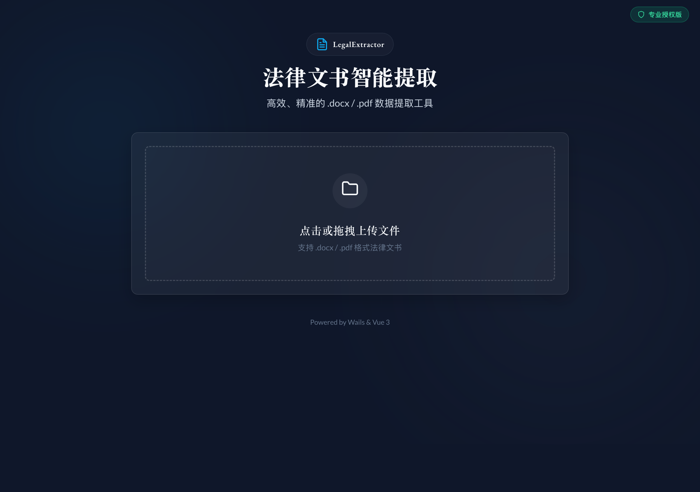

<p align="center">
  
</p>

<h1 align="center">Legal Document Extractor</h1>

<p align="center">
  <strong>Next-Gen intelligent information extraction from legal documents with high-performance OCR</strong>
</p>

<p align="center">
  English | <a href="README.zh-CN.md">简体中文</a>
</p>

<p align="center">
  <a href="https://github.com/can4hou6joeng4/legal-extractor/releases/latest"></a>
  <a href="https://github.com/can4hou6joeng4/legal-extractor/actions/workflows/ci.yml"></a>
  <a href="https://goreportcard.com/report/github.com/can4hou6joeng4/legal-extractor"></a>
  <a href="https://github.com/can4hou6joeng4/legal-extractor/blob/main/LICENSE"></a>
  
  
  
</p>

---

<p align="center">
  
</p>

---

## ✨ Features

- 🚀 **v3.0 Next-Gen Engine** - Powered by Baidu AI Studio for high-precision legal document analysis.
- 📄 **Smart Parsing** - Auto-detect structure of `.docx` and `.pdf` legal documents.
- ⚡ **Parallel Processing** - 300% faster text extraction using Go Goroutines.
- 🎯 **Precise Extraction** - Extract key fields like defendant, ID, requests, and facts.
- 🧩 **Physical Slicing** - Support for 50+ pages long PDF documents.
- 👁️ **Live Preview** - Preview data before extraction to ensure accuracy.
- 💾 **Multi-format Export** - Support Excel (.xlsx), CSV, and JSON.
- 🐳 **Docker Ready** - Built-in Docker support for easy deployment.

---

## 🚀 Quick Start

### 🅰️ Desktop Version (Recommended for Individuals)

1. Download the installer for your platform from [Releases](https://github.com/can4hou6joeng4/legal-extractor/releases)
2. **macOS**: Download `.dmg`, open and drag to Applications
3. **Windows**: Run `legal-extractor_setup.exe` installer

### 🅱️ Web Version (Recommended for Teams/Servers)

Run the following command to start the Web version instantly:

```bash
# 1. Set your Baidu Token (Required for PDF OCR)
export LEGAL_EXTRACTOR_BAIDU_TOKEN="your_baidu_token"

# 2. Start with Docker Compose
docker-compose up -d

# 3. Access in Browser
# http://localhost:8080
```

### Usage

1. Click **"Select Files"** to choose legal documents
2. Click **"Preview"** to verify extracted data (Optional)
3. Click **"Extract & Save"** to export structured data

---

## 🛠️ Development

### Prerequisites

- Go 1.24+
- Node.js 18+
- [Wails CLI](https://wails.io/docs/gettingstarted/installation) (For Desktop)
- Docker & Docker Compose (For Web)

### Setup

```bash
# Clone project
git clone https://github.com/can4hou6joeng4/legal-extractor.git
cd legal-extractor

# Install dependencies
cd frontend && npm install && cd ..
```

### Dev Mode

#### Desktop (Wails)
```bash
wails dev
```

#### Web (Backend + Frontend)
For full stack development with hot reload:

1. **Start Backend (Go)**
   ```bash
   # Install Air for hot reload
   go install github.com/air-verse/air@latest

   # Run
   air
   ```

2. **Start Frontend (Vite)**
   ```bash
   cd frontend
   npm run dev
   ```
   Open http://localhost:5173 (API requests will be proxied to backend)

---

## ⚙️ Configuration

### Baidu OCR (Required for PDF)

The project uses Baidu AI Studio (PaddleOCR-VL) for high-precision document analysis.

📖 **[Read the Full Configuration Guide](docs/user/CONFIG_GUIDE.md)**

**Option 1: Environment Variables**
- `LEGAL_EXTRACTOR_BAIDU_TOKEN` (Access Token for Baidu Cloud)

**Option 2: Configuration File**
Create `config/conf.yaml`:
```yaml
baidu:
  token: "your_baidu_token"
```

---

## 📁 Project Structure

```
legal-extractor/
├── cmd/
│   └── server/          # Web Server Entrypoint (REST API)
├── internal/            # Core logic
│   ├── app/             # Desktop App Logic (Wails bindings)
│   ├── config/          # Configuration management
│   ├── extractor/       # Extraction Engine (PDF/DOCX/OCR)
├── frontend/            # Vue 3 Frontend (Adaptive UI)
│   ├── src/services/    # API Adapter (Web/Desktop)
├── build/               # Build assets & installers
├── Dockerfile           # Web Version Dockerfile
├── docker-compose.yml   # Docker Compose Config
└── README.md
```

---

## 📝 Extraction Fields

| Field         | Rule                                           |
| :------------ | :--------------------------------------------- |
| **Defendant** | Extracted from text after "被告:" (Defendant:) |
| **ID Number** | 18-digit ID number patterns                    |
| **Requests**  | Content between "诉讼请求" and "事实与理由"    |
| **Facts**     | Content between "事实与理由" and "此致"        |

---

## 📄 License

[MIT License](LICENSE) © 2026

---

<p align="center">
  <sub>Made with ❤️ using <a href="https://wails.io">Wails</a> & <a href="https://vuejs.org/">Vue 3</a></sub>
</p>
